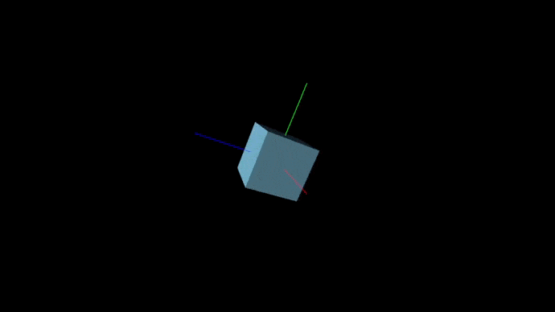

# threejs-golang-example
THREE.js example of rotating cube using gopherjs bindings. 160 lines of Go code.
### How to run example
Drop `index.html` in a browser window or open using browser.

### How I did this
1. Code the project in Go. The program is contained in [`main.go`](main.go).
2. Generate javascript using [`gopherjs`](https://github.com/gopherjs/gopherjs) with command:
    ```shell
    gopherjs build
    ```
3. Create my html page manually as [`index.html`](index.html)
